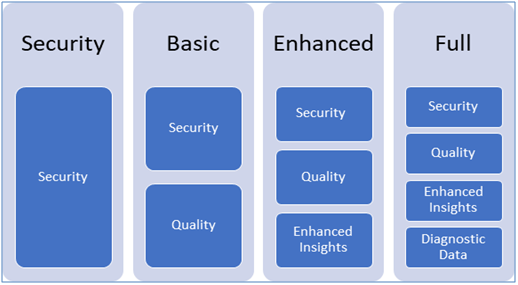

# Understanding Telemetry

## What is Telemetry?

The word ‘Telemetry’ is derived from its Greek etymological roots, tele - remote and metron - measure.

In today’s connected world, Telemetry is a term used for technologies that automatically record and measure statistical data from real-world use and forward it to IT systems in a remote location for further analysis and study. Telemetry is used in a myriad of industries from tracking spacecrafts, medical monitoring, tracking wildlife, and so on.

'Events' are broad, human-readable actions, that can be tracked as a string. Events are used to categorize telemetry data.They are the basic unit for analytics and help identify user navigation or flow.

The concept of telemetry events is to identify:

**Who** did **what**, **on** **what**, and **where**, **using** **what**, **in relation** to what?

Every event has the following sections and corresponding fields to capture the data:

| Section | Description | Attributes |
| :--- | :--- | :--- |
| About | About the event | ets mid |
| Who | About the actor | uid |
| did | Verb or action | eid |
| on what | Action on what object? | content\_id content\_ver |
| and where | Context of the action | env did sid channel pdata |
| using what | Using which tool? | ? |
| In relation to | Related to which action? | cdata |

## Why we need Telemetry?

The objective of telemetry is to assist in product, application or service development, modification or security. It works as a framework. Telemetry enables automatic collection of data from real-world, real-time use.

Typically, there are four levels of telemetry:

* Security
* Basic
* Enhanced
* Full

The level of data collected is a discrete decision of an organization or business. Analysis of this data offers insights into product and user behaviour and usage patterns, driving business decisions and research outcomes. You can program your telemetry analytics to suit your requirements.

Sunbird’s telemetry service has Full level telemetry.

