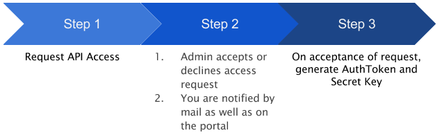
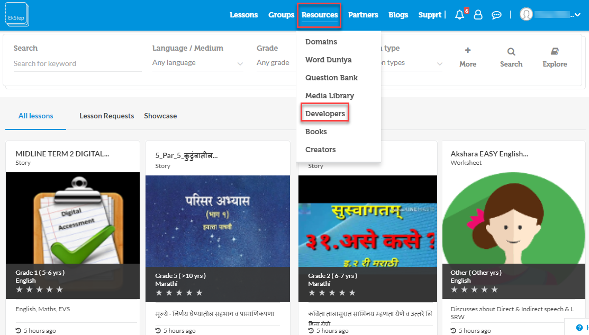
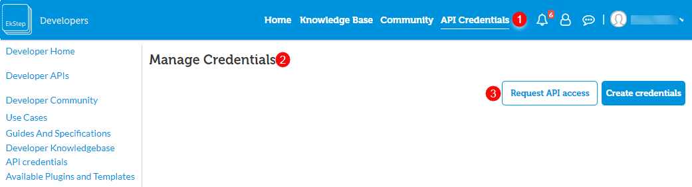
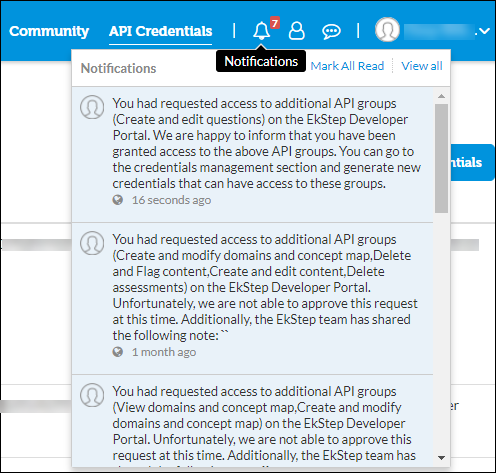
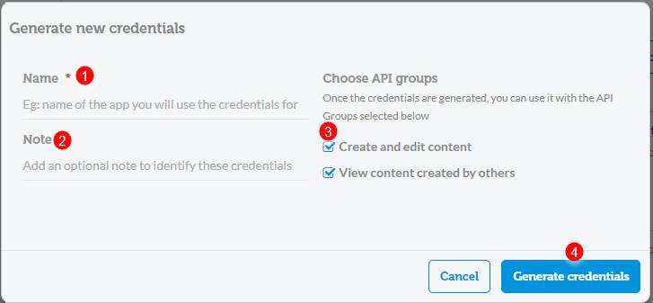
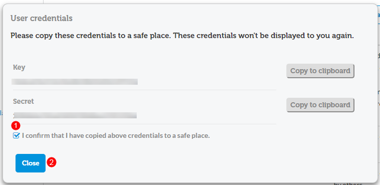

# authtokengenerator\_jslibrary

## Methods

The following API methods are provided by the AuthToken generator library

### Generate new AuthToken

```text

generate: function(key, secret){}
```

Request Arguments:

```text

key- "key" of the JWT Credential For ex: '398e54e888da42f8d089je28c298o42b'
secret- "secret" of the JWT Credential For ex: '07c6e2t1rb92987fnrd705jkk8582p9e'
```

### Regenerate Expired AuthToken

```text

refresh: function(oldAuthToken) { }
```

### Generate JWT With Bash

Authtoken can be generated using the bash script also, for more details refer [https://willhaley.com/blog/generate-jwt-with-bash/](https://willhaley.com/blog/generate-jwt-with-bash/)

## How to generate authorization credentials

This section details the procedure to generate the AuthToken and secret key that is required to access any APIs and to configure the standalone telemetry JS library.

### Process



### Prerequisites

* Access to the Ekstep Community portal

### Procedure

<table>
  <thead>
    <tr>
      <th style="text-align:left">Step</th>
      <th style="text-align:left">Screen</th>
    </tr>
  </thead>
  <tbody>
    <tr>
      <td style="text-align:left"><b>Sign In</b>
        <br />1. Sign in to Ekstep QA portal (https://qa.ekstep.in)
        <br />2. Go to Resources &gt; Developers
        <br /> <b>Note:</b> If you have already created QA credentials and tested Sunbird,
        and are looking at acquiring production credentials, repeat the same steps
        on visit <a href="https://community.ekstep.in/api-credentials">https://community.ekstep.in/api-credentials</a> instead.</td>
      <td
      style="text-align:left">
        
        </td>
    </tr>
    <tr>
      <td style="text-align:left"><b>Request API Access</b>
        <br />1. Select <b>API credentials</b>
        <br />2. The <b>Manage Credentials</b> page is displayed
        <br />3. Click <b>Request API access</b> to request access for available API groups</td>
      <td
      style="text-align:left">
        
        </td>
    </tr>
    <tr>
      <td style="text-align:left">
        <p>On successful submission of the API access request, the portal admin is
          notified. The admin either approves or rejects the request</p>
        <p>You are notified of the admin&#x2019;s action through a mail to your registered
          mail ID</p>
        <p>You can also view the action taken, by clicking the notification icon
          on the portal</p>
      </td>
      <td style="text-align:left">
        
      </td>
    </tr>
    <tr>
      <td style="text-align:left"><b>Generate New Credentials</b>
        <br />1. Enter the username
        <br />2. Enter notes, if any
        <br />3. The API groups that can be accessed with the created credentials are
        listed here
        <br />4. Click <b>Generate credentials</b> to generate key and secret</td>
      <td
      style="text-align:left">
        
        </td>
    </tr>
    <tr>
      <td style="text-align:left"><b>Note the Credentials</b>
        <br />1. Ensure to copy the key and secret and confirm the same
        <br />2. Click <b>Close</b> after copying the Key and Secret</td>
      <td style="text-align:left">
        
      </td>
    </tr>
  </tbody>
</table>

